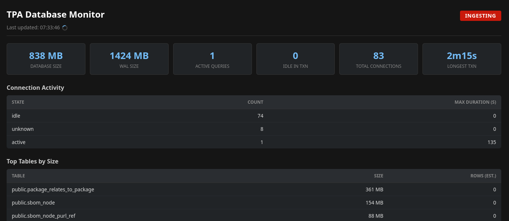
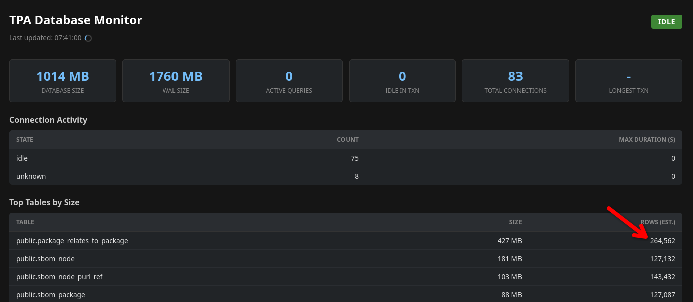
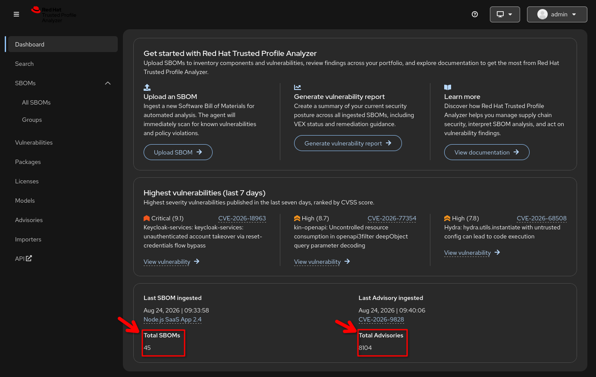

# Trusted Profile Analyzer - RHDP Deployment

Deploys [Red Hat Trusted Profile Analyzer](https://docs.redhat.com/en/documentation/red_hat_trusted_profile_analyzer) and all required components on OpenShift using an ArgoCD app-of-apps pattern.

## Provisioning via RHDP

This repository is designed to be deployed through the [Field Content CI](https://catalog.demo.redhat.com/catalog/all?item=babylon-catalog-prod%2Fpublished.ocp-field-asset.prod) catalog item on Red Hat Demo Platform.

When ordering, fill in the provisioning form as follows:

| Field | Value |
|-------|-------|
| **Existing Gitops Repo?** | Checked |
| **GitOps Repo** | `https://github.com/redhat-tssc-tmm/rhdp-tpa-demo.git` |
| **GitOps Revision** | `main` |
| **GitOps Path** | `.` |

> **Important:** The GitOps Path must be set to `.` (a single dot). Leaving it empty will cause the ArgoCD Application to fail with an `InvalidSpecError` because ArgoCD requires an explicit path value.

## Components

| Component | Description |
|-----------|-------------|
| **Prerequisites** | ObjectBucketClaim (S3 via Noobaa), OIDC client secret, Keycloak realm import |
| **PostgreSQL** | Database backend for TPA (RHEL 10 / PostgreSQL 18) |
| **TPA Server** | Trusted Profile Analyzer server (external Helm chart from `charts.openshift.io`) |
| **Demo Dataset** | Uploads a demo dataset to the TPA server (optional, can be disabled independently) |

### Prerequisites

The prerequisites component deploys:
- **ObjectBucketClaim** — creates an S3 bucket (`tpa-bucket`) via ODF/Noobaa for TPA document storage
- **OIDC CLI Secret** — Keycloak client secret for the TPA CLI service account
- **KeycloakRealmImport** — imports the `tssc-sso` realm into Keycloak (deployed to the configurable `keycloak` namespace) with:
  - TPA client scopes: `create:document`, `read:document`, `update:document`, `delete:document`
  - `tpa-cli` client (service account with all document scopes)
  - `tpa-frontend` client (public client with all document scopes)
  - `admin` user (password: `r3dh8t1!`, role: `tpa-admin`)
  - `tpa-admin` role mapped to all document scopes

> **Note:** After the KeycloakRealmImport completes, the `tssc-sso` realm endpoints are immediately available (OIDC discovery, token issuance, etc.), but the realm may not appear in the Keycloak Admin UI until the Keycloak pod is restarted (`oc delete pod keycloak-0 -n keycloak`). This is cosmetic only — the automated TPA deployment is not affected.

### PostgreSQL

Deploys a PostgreSQL 18 instance with:
- Credentials stored in a Secret (`tpa-postgresql-credentials`)
- 30Gi persistent storage
- WAL and memory tuning via ConfigMap
- ClusterIP service on port 5432

### TPA Server

Deploys the Trusted Profile Analyzer server using the `redhat-trusted-profile-analyzer` Helm chart from `charts.openshift.io`. The following values are dynamically computed from `deployer.domain` (injected by RHDP):
- `appDomain` — OpenShift route suffix
- `storage.region` — Noobaa S3 endpoint
- `oidc.issuerUrl` — Keycloak realm URL

The chart version is controlled by `components.tpaServer.chartVersion` in `values.yaml` (defaults to `*` for latest). To pin a specific version:

```yaml
components:
  tpaServer:
    chartVersion: "3.1.0"
```

To list available versions:

```bash
helm repo add openshift https://charts.openshift.io/
helm repo update openshift
helm search repo openshift/redhat-trusted-profile-analyzer --versions
```

### Demo Dataset

Runs a Kubernetes Job that downloads a dataset ZIP and uploads it to the TPA server's `/api/v3/dataset` endpoint. The Job handles OpenShift route timeouts gracefully — HTTP 504 or dropped connections after a completed upload are treated as success, since the TPA server continues processing in the background.

The dataset is stored in the `datasets/` directory and referenced via a raw GitHub URL. To use a different dataset, add the file to `datasets/` and update the URL:

```yaml
components:
  demoDataset:
    enabled: true    # set to false to skip dataset upload
    datasetUrl: "https://raw.githubusercontent.com/redhat-tssc-tmm/rhdp-tpa-demo/main/datasets/my-other-dataset.zip"
```

### Database Monitor

The demo-dataset component includes a lightweight database monitor web app that provides real-time visibility into PostgreSQL activity during dataset ingestion. It is accessible via an OpenShift Route at `https://tpa-db-monitor-<namespace>.<domain>`.

The monitor queries the database only when the page is open (no background polling). It auto-refreshes every 10 seconds.

**During ingestion**, the status shows **INGESTING** (red badge). Active queries and long-running transactions are visible, while row counts in the Top Tables section remain at zero because the transaction has not yet committed:



**After ingestion completes**, the status switches to **IDLE** (green badge). The row counts are now populated, confirming the data has been committed to the database:



**In the TPA UI**, after ingestion finishes, the dashboard shows the ingested SBOM and advisory statistics at the bottom of the screen (Total SBOMs and Total Advisories):



## Deployment Order

ArgoCD sync waves ensure components deploy in the correct order:

| Wave | Components |
|------|------------|
| 0 | Prerequisites, PostgreSQL (deploy in parallel) |
| 1 | TPA Server (waits for wave 0 to be healthy) |
| 2 | Demo Dataset upload (waits for TPA server to be ready) |

## Repository Structure

```
rhdp-tpa-demo/
├── Chart.yaml                  # App-of-apps root chart
├── values.yaml                 # Global configuration
├── templates/
│   └── applications.yaml       # Generates ArgoCD Application CRs
├── components/
│   ├── prerequisites/          # OBC, OIDC secret, Keycloak realm import
│   │   ├── Chart.yaml
│   │   ├── values.yaml
│   │   ├── files/
│   │   │   └── realm-tssc-sso.json
│   │   └── templates/
│   ├── postgresql/             # PostgreSQL database
│   │   ├── Chart.yaml
│   │   ├── values.yaml
│   │   └── templates/
│   └── demo-dataset/           # Dataset upload Job + DB monitor deployment
│       ├── Chart.yaml
│       ├── values.yaml
│       └── templates/
├── apps/
│   └── db-monitor/             # DB monitor source (excluded from Helm via .helmignore)
│       ├── app.py              # Flask app — image: quay.io/tssc_demos/tpa-db-monitor
│       ├── Containerfile
│       ├── requirements.txt
│       └── templates/
├── datasets/                   # Dataset ZIP files (referenced by URL)
├── examples/                   # Reference: field-content template examples
└── roles/                      # Reference: AgnosticD workload role
```

## Configuration

All settings are in `values.yaml`. Key values:

```yaml
fieldContentName: tpa                        # Prefix for child ArgoCD Application names
tpaNamespace: trusted-profile-analyzer       # Target namespace for all TPA components
```

Component-specific settings are under `components.<name>` in `values.yaml`:
- `components.prerequisites` — OBC bucket name, OIDC secret, Keycloak namespace
- `components.postgresql` — credentials, storage, image, tuning, resources
- `components.tpaServer` — chart version, OIDC settings, ingress, importers
- `components.demoDataset` — dataset URL, enable/disable

## Local Testing

```bash
helm lint .
helm template tpa .
helm template tpa . --set tpaNamespace=my-namespace
```
