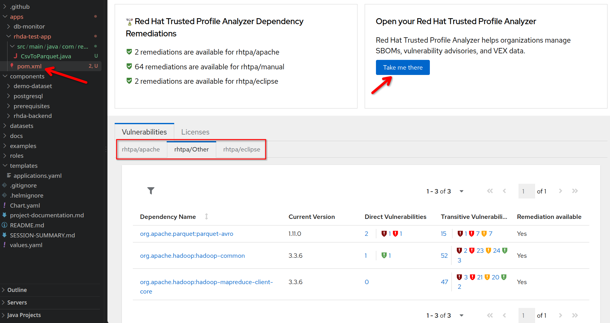

# Red Hat Dependency Analytics (RHDA) Plugin Guide

## Overview

The [Red Hat Dependency Analytics](https://marketplace.visualstudio.com/items?itemName=redhat.fabric8-analytics) VS Code plugin analyzes your project's dependencies for known vulnerabilities and license issues by communicating with the RHDA backend deployed on this cluster.

## Using the Plugin

1. Install the **Red Hat Dependency Analytics** extension in VS Code
2. Configure the backend URL in VS Code settings:
   - Setting: `Red Hat > Dependency Analytics > RHDP TPA Backend URL`
   - Value: `https://rhda.<cluster-domain>` (e.g., `https://rhda.apps.cluster-xyz.dyn.redhatworkshops.io`)
3. Open a `pom.xml` (Maven), `package.json` (npm), or other supported manifest file
4. The plugin automatically triggers a vulnerability scan against the TPA instance on the cluster

A test application is included in this repo at `apps/rhda-test-app/` — open its `pom.xml` to verify the plugin is working.

## Understanding the Analysis Results

### Vulnerability Sources

The plugin groups vulnerabilities by **source**, displayed as tabs like `rhtpa/apache`, `rhtpa/Other`, `rhtpa/eclipse`. These names are constructed from two parts:

- **`rhtpa`** — the provider name, derived from the RHDA backend's `PROVIDER_RHTPA_HOST` environment variable. This identifies TPA as the vulnerability data provider.
- **The part after `/`** — the advisory source, which comes from metadata attached to each advisory in TPA's database:
  1. **Importer name** (`advisory.labels.importer`) — if the advisory was ingested by a TPA importer (e.g., `redhat-csaf`, `cve`, `osv-github`)
  2. **Issuer name** (`advisory.issuer.name`) — if no importer label exists, the advisory issuer is used (e.g., `apache`, `eclipse`)
  3. **`manual`** — fallback when neither importer nor issuer is set, typically for advisories uploaded via dataset

| Source | Meaning |
|--------|---------|
| `rhtpa/apache` | Advisories issued by the Apache Software Foundation |
| `rhtpa/eclipse` | Advisories from Eclipse Foundation projects (e.g., Jetty, Jersey) |
| `rhtpa/manual` | Advisories from dataset uploads with no importer/issuer metadata (e.g., OSV/GHSA advisories from the demo dataset) |
| `rhtpa/Other` | Advisories with an unrecognized or generic issuer |
| `rhtpa/osv-github` | Advisories ingested by the OSV GitHub importer (if enabled) |
| `rhtpa/redhat-csaf` | Red Hat CSAF advisories (if the CSAF importer is enabled) |

### Direct vs. Transitive Vulnerabilities

The plugin resolves the full dependency tree from your manifest file, not just the declared dependencies. For example, `parquet-avro:1.11.0` has 2 direct vulnerabilities, but its transitive dependencies (pulled in via Maven resolution) contribute many more. The vulnerability table shows both counts.

### "Take me there" Button

Clicking **"Take me there"** opens the TPA web UI on the cluster, where you can explore SBOMs, advisories, and vulnerability details in full. The URL is derived from the `BRANDING_EXPLORE_URL` configured in the RHDA backend deployment.
